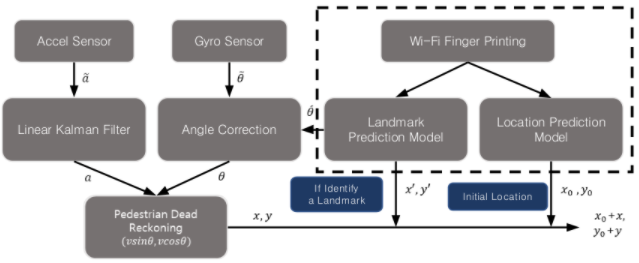
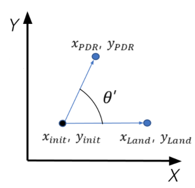

# ronin-and-wifi-landmark Fusion

RoNIN ResNet-18 모델과 Autoencoder 기반의 Landmark detection의 융합을 통한 궤적을 추정합니다. Tensorflow 를 이용한 학습에 관련된 코드는 [이곳](https://github.com/chanyeong97/Real-time-INS-python)에서 확인하실 수 있습니다


## 개요

- 관성센서를 활용한 AI기반의 정밀 궤적 위치추정 방법[RoNIN]과, 지문방식 절대 측위 방법과의 융합을 통한 실내 정밀측위 및 자동오차보정이 가능한 측위 시스템입니다

<p align="left"></p>
<p align="left"></p>

## Requirements

- python
- scipy
- numba
- torch
- torchvision
- pandas
- tensorflow
- matplotlib
- numpy-quaternion

## 데이터

- 데이터 수집을 위한 [안드로이드 어플](https://drive.google.com/file/d/1_q-J31AV47K7j9ukMWygSgViQL8_IFTk/view?usp=sharing)을 이용하여 가속도, 자이로스코프 및 와이파이 값을 저장하고 학습에 맞게 전처리합니다
- RoNIN
```bash
python preprocessing.py --ronin <pretrained ronin resnet model path> --dataset <dataset path>
```


## 학습

### Autoencoder 학습
```python main.py --mode train --model autoencoder --autoencoder <autoencoder model path> --train_dataset <train dataset path> --bssid <임의의 경로>```

### Landmark detection 학습
```python main.py --mode train --model landmark --autoencoder <autoencoder model path> --landmark <landmark model path> --train_dataset <train dataset path> --bssid <autoencoder 학습시 지정한 경로>```

## 평가

1. landmark에 해당하는 위치정보를 config.py의 LANDMARK_POSITION에 기입합니다
2. ronin과 landmark detection의 융합으로 궤적을 나타냅니다
```python main.py --mode test --model test --autoencoder <autoencoder model path> --landmark <landmark model path> --ronin <pretrained ronin resnet model path> --test_dataset <test dataset path> --bssid <autoencoder 학습시 지정한 경로>```

<p align="center"></p>
